# Hands on Lab 1 - Introduction to the Azure Portal #

Overall time to complete: **20 minutes**

Prerequisites: **A valid Azure subscription and a valid Microsoft or Organizational that is able to access the subscription**


#1. Managing Azure Services #

There are two web portal available to manage your everything you need to in Microsoft Azure. In this hands on lab we will look at both portals and consider how to navigate around the various services that Azure provides. 

We'll look at the [Management Portal](https://manage.windowsazure.com "Management Portal") which allows administrators to view and administer most, but not all Azure services and features. A newer portal is currently in preview. This is the "[Azure Preview Portal](https://portal.azure.com/ "Azure Preview Portal")". We'll be taking a look at this too as many of the features that are both generally available and in preview are not accessible through the Management Portal.

During this lab please bear in mind that the first "port of call" to manage your Azure services should be done through the Azure Preview Portal but as certain functionality is not available in this portal we will be considering the Management Portal to plug the gap.


## Service Naming ##

Service names in Azure are unique. So, for example, a storage account that is named *analyticscourse* will be unique across all of Azure. As such please choose unique names for the services in lieu of the example names in this lab and ensure that the names are within the bounds of the service naming policy, but which we generally mean the minimum and maximum number of characters which the portal will reveal to you. If in doubt use lower case for all naming. You'll find that certain words are not permitted in service names as well but the portal will return you a concrete explanation if you choose one of these reserved names.


## Locations ##

In this lab we will be creating a number of Azure services. Examples of some of the more important ones are:

- storage
- compute 
- resource groups  

Microsoft has invested in data centers across the globe. For the purpose of this lab and others we will choose a single data center and use that throughout. Whilst this is not mandatory, it's relevant for a number of reasons.

- you're charged egress costs on data leaving a data center
- intra-datacenter routing is faster and doesn't need to cross the internet


In this lab we'll typically choose the "North Europe" location but it's important to choose the data center location closest to you.

The following shows the available data centers. Microsoft has Azure data centers in China too which are not shown on this list.

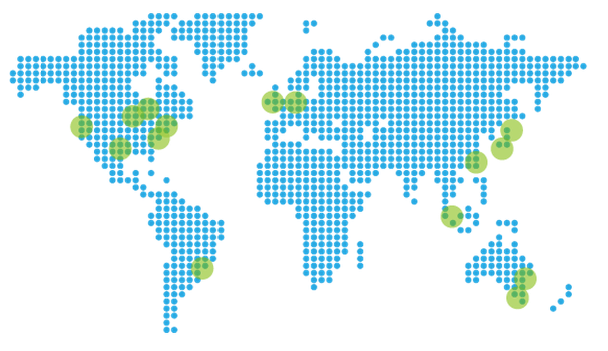 


AZURE REGION		|	LOCATION
--------------------|-----------
Central US			|	Iowa
East US				|	Virginia
East US 2			|	Virginia
US Gov Iowa			|	Iowa
US Gov Virginia		|	Virginia
North Central US	|	Illinois
South Central US	|	Texas
West US				|	California
North Europe		|	Ireland
West Europe			|	Netherlands
East Asia			|	Hong Kong
Southeast Asia		|	Singapore
Japan East			|	Saitama Prefecture
Japan West			|	Osaka Prefecture
Brazil South		|	Sao Paulo State
Australia East		|	New South Wales
Australia Southeast	|	Victoria


# 2. Change Subscription #

Time to complete: **2 minutes**

In this section we'll consider how to change from one subscription to another in the Preview Portal if you have access to more than one subscription. When we do this we should be able to list and create items within this Azure subscription.

1. 	Navigate to [https://portal.azure.com/](https://portal.azure.com/) and sign with your Microsoft or Organizational account 
2. 	In the upper right of the screen located the tile that displays your username

	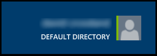 

3. 	Left-clicking this tile will show a drop down list containing all the subscriptions you have access to i.e.

	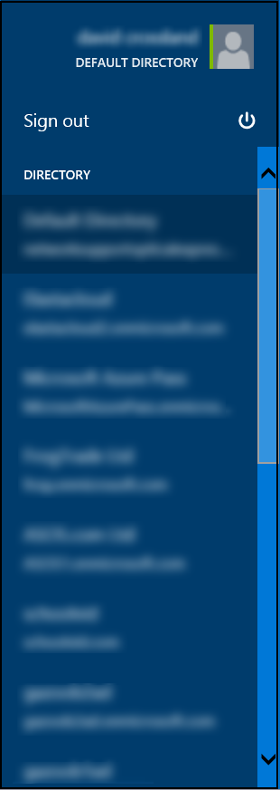 

4. 	Click the subscription you wish to change to. The portal should now take a few seconds to reload. For the next steps in this lab and others all items will be be created in this subscription.


# 3. Creating a Storage Account #

Time to complete: **10 minutes**
Outcomes: Creation of a single storage account, creating a storage container, updating the container policy, installing and using azcopy and uploading data to the storage account


## 3.1. Overview ##

We will look at how to create a new Storage Account within a Resource Group. For the purpose of this lab and others it is important to use a common naming prefix and suffix with all of the service names e.g. msft-nedata144 or msft-wedata181 

Azure storage is a scalable, durable, and highly available multi-tenant storage service which provides up to 6 copies of your data across 2 data centers. 

Storage provides 4 services which can be used in conjunction with other Azure services such as virtual machines which we'll look at later. These services are:

- Blobs (binary data such as files or virtual hard drives)
- Tables (semi-structured data storage with a scalable and dynamic schema)
- Queues (simple message data with TTLs and properties)
- Files (an SMB share used by virtual machines) 

This exercise will focus on blob storage. There are two types of blobs.

- Block blobs (file data, akin to files on disk)
- Page Blobs (Random IO data such akin to an operating system swap file and used for virtual hard drives)

Blob storage can have policies applied to it and has a unit of aggregation called a container under which blobs can be stored. Storage is protected by two 512 bit AES keys so write a blob to storage we will need the storage account name, one of the keys and the container name.

We'll be creating a storage account in a resource group. The resource group is a new feature in the Preview Portal which allows distinct Azure resources such as storage, databases and compute to be logically grouped together.

During this exercise we'll be using the term "blade" which will refer to various windows you'll be seeing which look like the images in the lab.


## 3.2. Creating a storage account ##

Microsoft Azure supports multiple methods to create and manage storage accounts.  This exercise will demonstrate using the Azure Portal to create a new storage account.

1. 	Navigate to the Microsoft Azure portal [https://portal.azure.com/](https://portal.azure.com/).

2. 	In the upper left hand corner of the screen Click New -> Data + Storage and select Storage.

	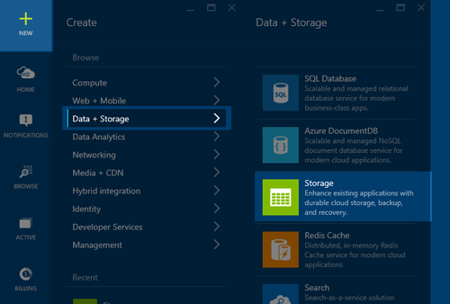 

3. 	Review the options in the **Storage account** blade. 

	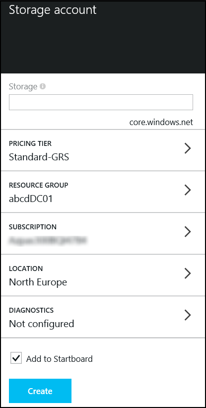

4. 	Enter a name for the storage account. A warning will appear if the name is not globally unique.

6. 	Click on pricing tiers to display the Pricing Tiers blade.  Select LRS and click **Select** in the lower left corner of the blade. 

	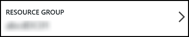

	There are threes types of storage replication visible:
	
	- Globally Redundant Storage (GRS) copies all data 3 times in the local data center and 3 times in a secondary data center
	
	- Locally Redundant Storage (LRS) copies data 3 times in the local data center
	
	- Read Accessible Globally Redundant Storage (RA-GRS) copies data 3 times in the local data center and 3 times in a secondary data center but allows secondary read only access unlike GRS

Ensure that when this step is complete you click Select at the bottom of the blade.

7. 	Click Resource Group to open the **Resource group** blade.

	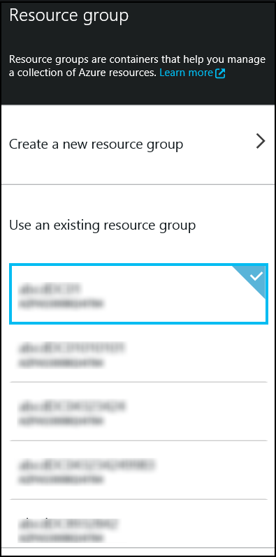

8. 	Click **Create New Resource Group** at the top of the blade.  

	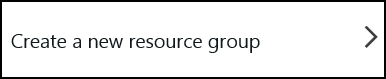

9. 	Enter a name for the resource group and click **OK** to save the change and close the blade. 

	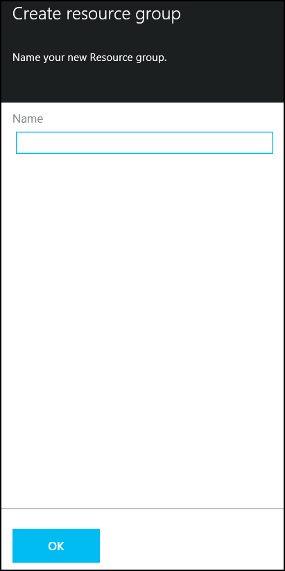

10.	In the **Storage Account** blade, click on Location to open the Location blade.  Validate the location is set to the correct data center.  In our example, we are using North Europe.

11. Review the options of the new storage account.  Note that the **Add to Startboard** is automatically selected, which will add a tile for this new storage account to the Startboard.  Click **Create** in the lower left corner of the blade to create the storage account.  The process may require 2-3 minutes. 

	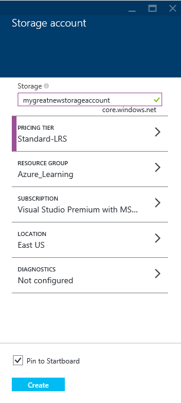

12. Once the storage account has been created the following will be displayed. You will see the main dashboard and the storage account creation should be visible. 

	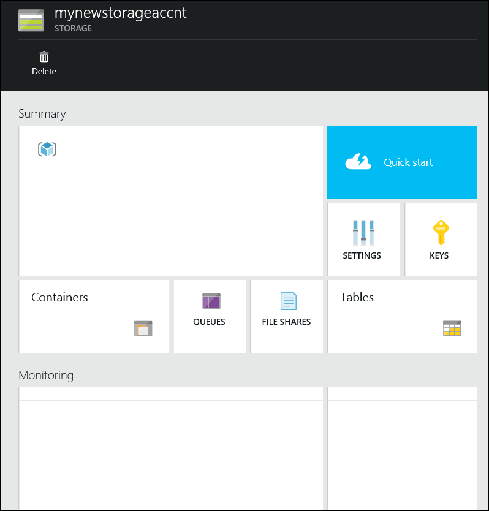
	

## 3.3. Create an Azure Blob Storage Container ##

Data in the storage account is stored and organized in containers.  The following steps will create a container that will be used in the remaining labs.  The final steps of this section will walk through using AZCopy to move data from the course virtual machine to the new storage account container.  

1. 	Navigate to the newly created storage account and review the properties and options for this account.   

	

2. 	Select **Containers** to open the Containers blade.

	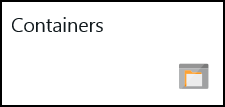

3. 	The **Containers** blade supports viewing, editing and creating storage containers. 

	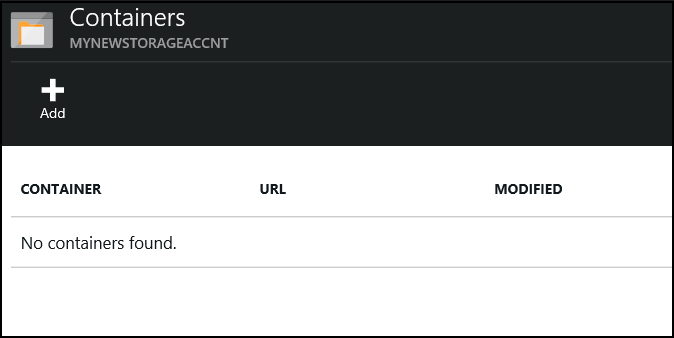

4. 	Our labs will require a storage container named **data**.  Select Add from the top menu of the blade. 

	

5. 	A new **Add a container** blade will open.  Enter the name **data** for the container.  Note the options for **Access type**, which we also refer to as the policy.  The default access type is **Private**.  Private will require a key to access data in the container, and will be the most secure. Validate the Access type is set to Private for our exercises.  Click **OK** in the lower left corner of the blade.  

	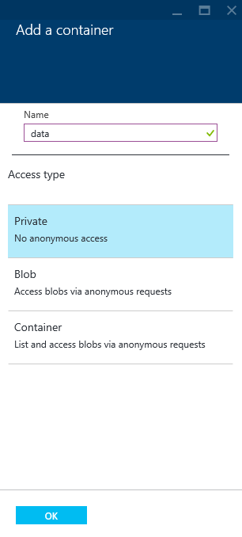

	n.b. If we changed the policy to one of the other two options we would be able to download data with just URLs. This is a great mechanism for sharing files to the world but not when you're using services where you want to keep the data private.

6. 	The new container named **data** is now listed in the Containers blade.  Close the Containers blade by clicking the X in the upper right corner of the blade.  You will return to the storage account blade.

	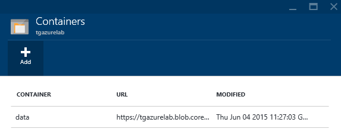

7. 	Our labs will require keys to add and remove data to the container in the storage account.  Select the highlighted **keys**.

	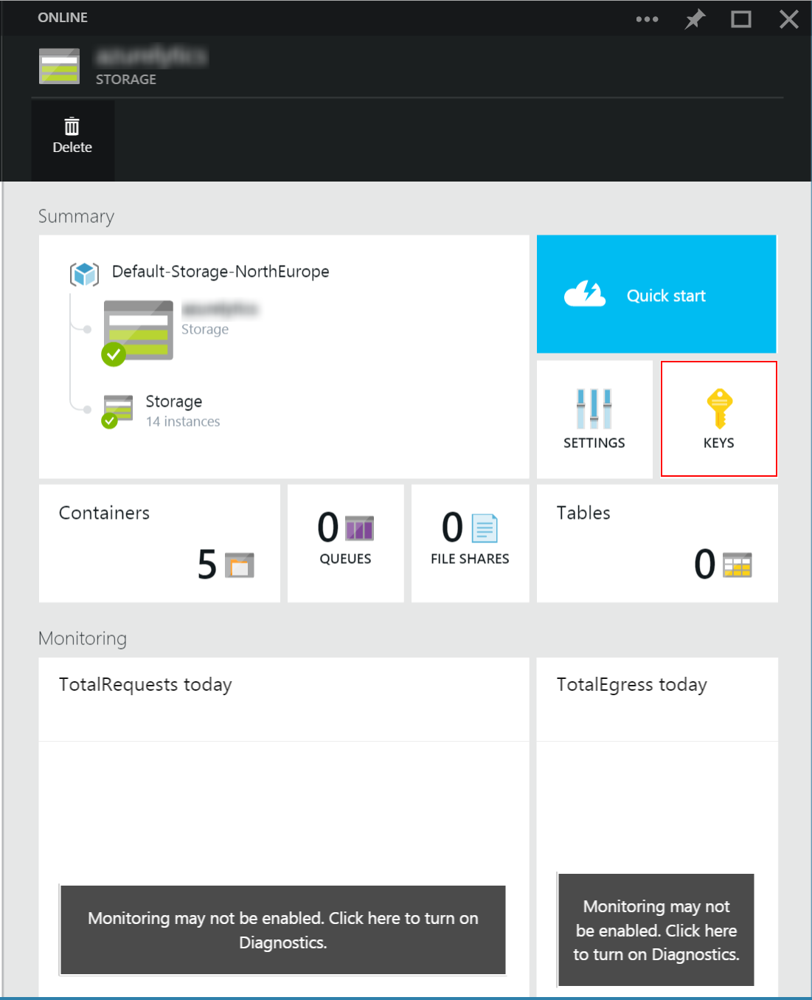

8. 	Note the options in the Manage Keys blade.  
	- In addition to copying keys for use in applications, notice the option to regenerate keys in the upper menu of the blade.  Each organization will implement standards for using and rotating/regenerating keys to the storage account.  
	- Each storage account has a primary and a secondary access key.  

9. 	Our labs will use the primary access key.  Click on the copy button to the right of the **primary storage key** to save the key to the clipboard.  

	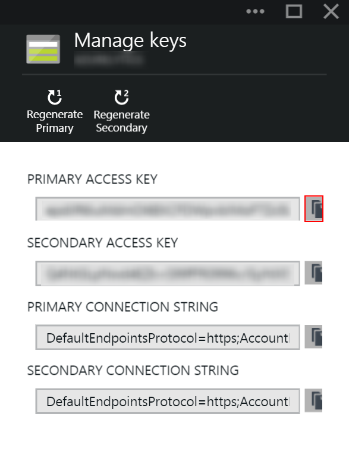

10.	Open Notepad from the taskbar of the desktop and paste the key in a new text document.  Save this document to the desktop, which will be used for several labs in this course. 


## 3.4 Moving Data With AZCopy ##

There are many great graphical tools from Microsoft partners like Cloudberry, Cerebrata, Red Gate and zudio ([http://zudio.co](http://zudio.co)) which can be used to manage Azure Storage.  For our labs we will use a command line utility from Microsoft called AZCopy.  AZCopy is a simple tool to upload, download and copy blobs between storage accounts.

If needed download and install Azcopy from [http://azure.microsoft.com/en-gb/documentation/articles/storage-use-azcopy/#install](http://azure.microsoft.com/en-gb/documentation/articles/storage-use-azcopy/#install "here") .  The lab image provided in class has already installed AZCopy. 


1.	Enter the following statement and note the options for the utility. Notice that a storage account key is required to copy or download data from the blob container. The key was saved to the text file in the previous steps.

	```azcopy -?```

2.	During this course we will process data from a file that is available on the student workstation.  To upload this file, enter the following at the command prompt.  Replace the **[account name]** and **[account key]** with the storage account name and key created in the previous steps.

    ```azcopy /Source:"**<path to labs>**\HOL 1\data" /Dest:https://**[account name]**.blob.core.windows.net/data/input /DestKey:**[account key]** /S```

Alternative tool : Azure Storage Explorer  https://azurestorageexplorer.codeplex.com


# 4. Microsoft Azure SQL Database #

Microsoft Azure SQL Database (Azure SQL Database) is a relational database-as-a-service, which falls into the industry category Platform as a Service (PaaS). Azure SQL Database is built on standardized hardware and software that is owned, hosted, and maintained by Microsoft. With SQL Database, you can develop directly on the service using built-in features and functionality. 

This exercise will demonstrate how to use the Azure portal to create and manage a SQL Azure Database.  At the end of this section you will have:
- A new Azure SQL Database and SQL Instance.
- Firewall settings to enable management through Management Studio.
- A new table which will be used in subequent labs.  


## 4.1 Create a Microsoft Azure SQL Database ##

The following steps will create an Azure SQL Database that will be used in subsequent labs.  

1. 	Navigate to the Microsoft Azure portal [https://portal.azure.com/](https://portal.azure.com/).

2. 	Click New -> Everything -> Data + Analytics and select the blue square labled **SQL Database**.  Note: DO NOT CHOOSE THE RED SQL SERVER RECTANGLE.

	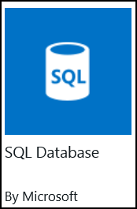

3. 	Click Create in the lower left corner of the SQL Database Overview Blade. The SQL Database blade is presented.  

	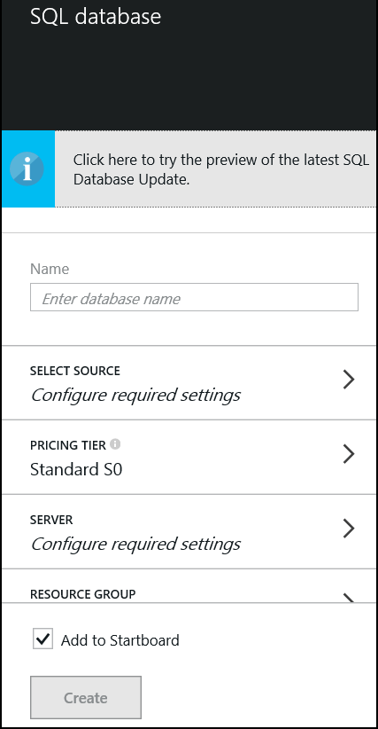

4. 	Enter the database name **cdcasa**. This database will be used in the Azure Stream Analytics lab. 

5. 	Press the **SELECT SOURCE** button and validate it is configured to **Blank Database**.  If needed, close the "Select Source" blade by clicking the X in the upper right corner of the blade.

	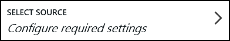

6. 	Press the **SERVER** button to configure a new server. 

	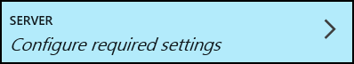

7. 	Click on **Create a new server** to open the New Server blade. 
	- Enter a server name, admin login and password.
	- Validate the location is set to the correct location as specified in the course.  All Azure services will be created in the same location.  
	- Validate the **ALLOW AZURE SERVICES TO ACCESS SERVER** option is checked at the bottom of the blade.
	
8. 	Once all the server settings are input, click **OK** in the lower left corner of the New Server blade.  This will close the blade and save the changes.  

    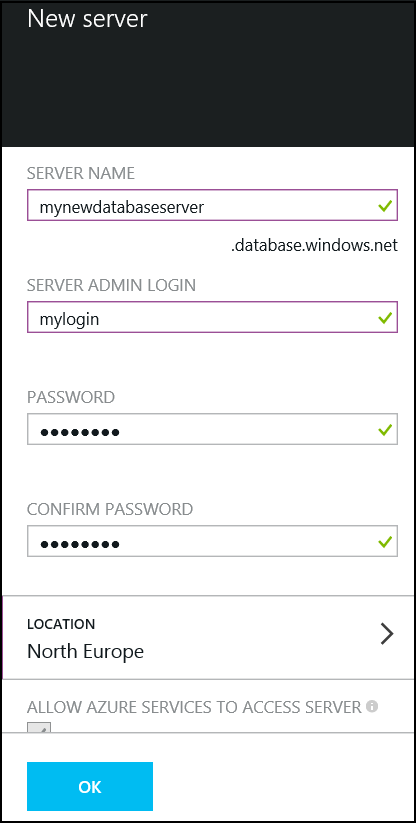

9.	Click on **PRICING TIER** to open the Recommended pricing tiers blade.  Select **Basic (B)**.  Click **Select** in the lower left corner of the blade to accept the change. 

10.	Click on **RESOURCE GROUP** to open the Resource Group blade.  Select the Resource Group to the new one created as part of the Storage Account creation lab.  

11.	Click Create once all configuraiton changes are made.  The Azure SQL Database will be available in approximately 2-4 minutes.  

	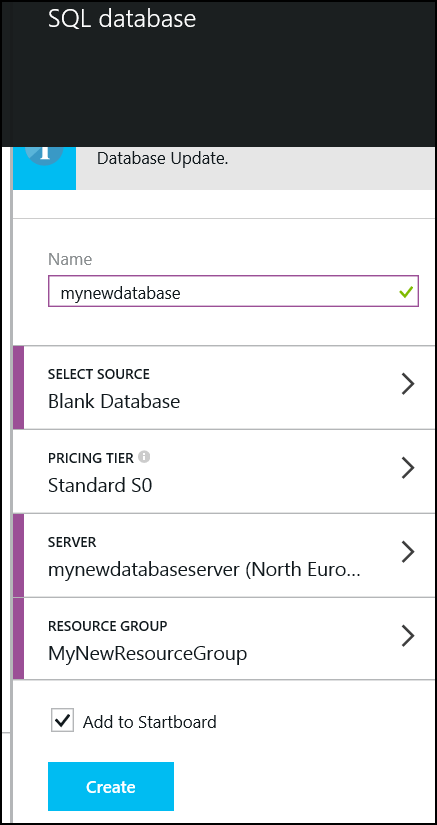


## 4.2 Configure Firewall Settings for the SQL Server ##

1. 	Connecting to the database and the server with tools like SQL Server Management Studio will require adding a firewall rule to the server instance.  To add a firewall rule to the server instance, navigate to the SQL Server via the azure portal 

	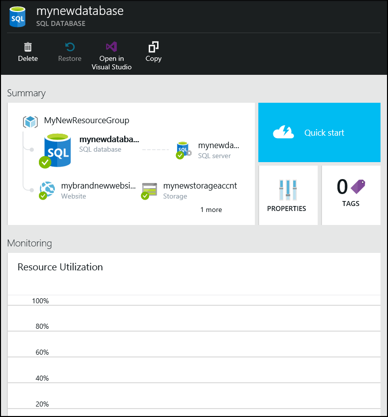

2. 	Click the SQL Server button to view the Server instances.  Be sure to select the Server instance and not the SQL Server Database.   

	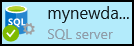

3. 	The Server Instance blade supports viewing and managing the instance.  

	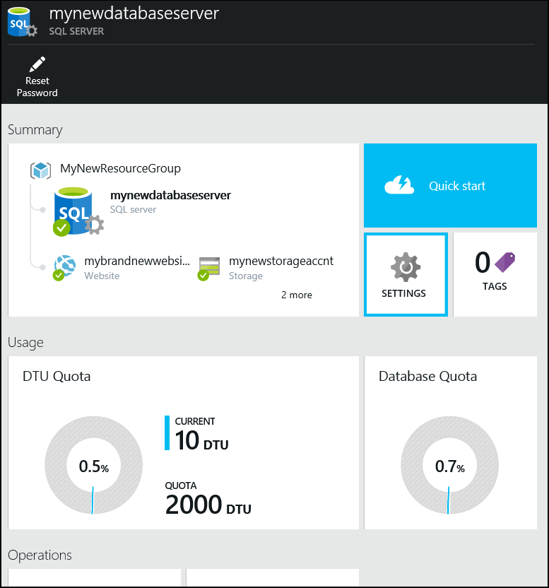

4. 	Click **Settings** to view and manage the instance settings.  

	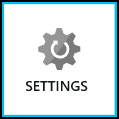

5. 	Click **Firewall** to display the firewall rules. 

	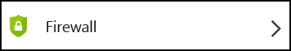

6. 	The following pane will be displayed. 

	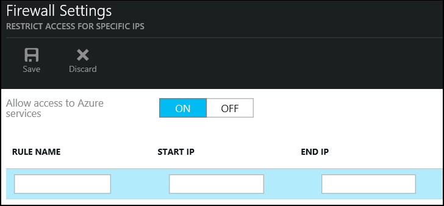

7. 	Enter the IP Address range appropriate to access the service.  The IP Address for the course virtual machine is found on the desktop wallpaper.  Be sure to use the Public IP.  

8. 	Click Save from the upper menu of the blade.  Once the changes are complete, a "Success" message will be returned.  Click OK. Close the Firewall Settings blade, and close all the blades to return to the Startpage of the portal. 

	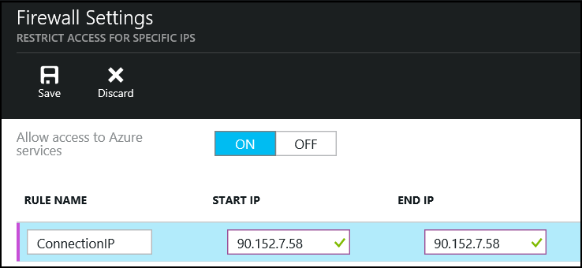

9. 	You can now connect to the SQL Server instance using SQL Server Management Studio.

Once completed with this section you will have:
- Created a new Azure database with a new SQL instance.
- Set a new firewall rule to enable access with Management Studio.

# 5. Optional Review: Virtual Machines #

An Azure virtual machine gives you the flexibility of virtualization without spending the time and money to buy and maintain the hardware that hosts the virtual machine. 

The Azure Preview Portal provides a centralized means to quickly create any number of machines (up to your subscription limit).  

Virtual Machines are deployed through Virtual Machine Images. Azure provides many images "out of the box" such as Windows and Linux images of various flavors as well as more specialized images such as WebLogic, Docker and Puppet Enterprise Server.

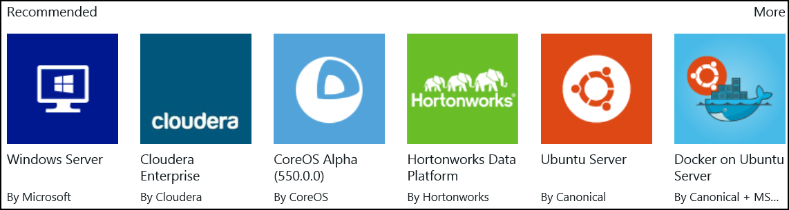

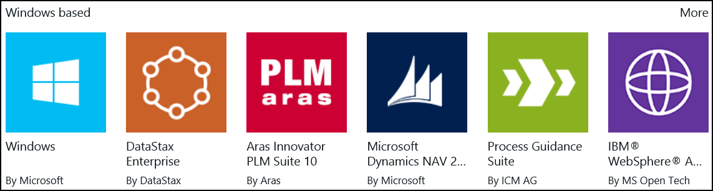

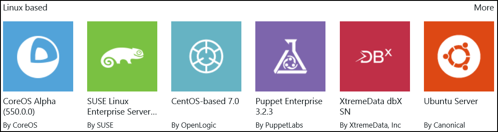


A number of images are provided through the VMDepot, this is a community-driven catalog of virtual machine images provided and licensed by community members. VMDepot images can only be customized Linux images.

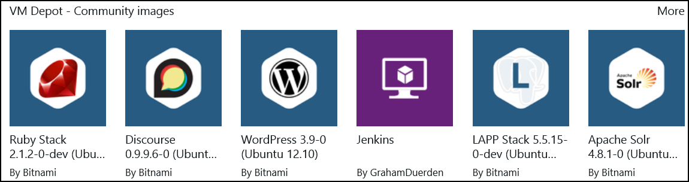

Virtual Machines are typically attached to a Cloud Service, which can contain any number of virtual machines. 

All virtual machines that you create in Microsoft Azure can automatically communicate using a private network  with other virtual machines in the same cloud service.  

Additionally you can create Azure Virtual Network (VNET) to easily extend an on-premises network through site-to-site VPN, much like the way you’d set up and connect to a remote branch office. 

You control the network topology, including configuration of DNS and IP address ranges, and manage it just like your on-premises infrastructure.
